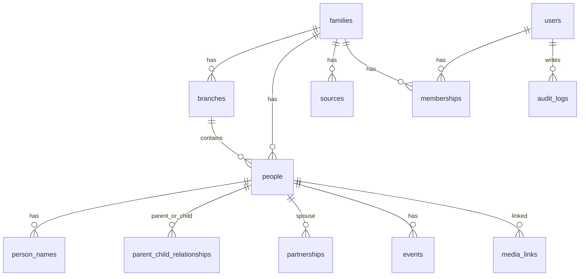

# 00 — Master Spec: Website Gia Phả

## 1. Tóm tắt điều hành

Dự án là một website gia phả với lộ trình từ một gia đình 4 thế hệ đến một nền tảng quản lý gia phả nhiều gia tộc. Trọng tâm không chỉ là vẽ sơ đồ cây, mà là xây dựng một hệ thống dữ liệu phả hệ bền vững: người, quan hệ, chi/phái, đời thứ, sự kiện, tài liệu, nguồn chứng cứ, quyền riêng tư và lịch sử chỉnh sửa.

Level 1 cần phục vụ dưới 100 người, chủ yếu bên nội, có đăng nhập, không công khai dữ liệu cho khách, có upload ảnh/tài liệu, có ngày giỗ âm/dương, có admin phân quyền và bảo vệ dữ liệu người còn sống.

---

## 2. Tầm nhìn dài hạn

Sản phẩm sẽ phát triển theo 3 tầng giá trị:

1. **Gia đình riêng:** lưu thông tin 4 thế hệ, tra cứu quan hệ, giữ ký ức gia đình.
2. **Gia tộc nhiều chi/phái:** phân quyền cho trưởng chi, quản lý dữ liệu lớn, nguồn chứng cứ, mộ phần, ngày giỗ, tài liệu.
3. **Nền tảng nhiều gia tộc:** nhiều gia đình tự đăng ký, có trang riêng, quota dung lượng, gói phí, dịch vụ số hóa gia phả.

---

## 3. Nguyên tắc sản phẩm

### 3.1. Gia phả là dữ liệu dài hạn

Dữ liệu gia phả có giá trị lâu dài hơn code. Vì vậy phải ưu tiên:

- Backup.
- Khả năng export.
- Audit log.
- Không hard delete.
- Không khóa dữ liệu vào một cấu trúc khó chuyển đổi.

### 3.2. Bảo mật người còn sống là yêu cầu lõi

Website chứa dữ liệu nhạy cảm: ngày sinh, số điện thoại, email, địa chỉ, ảnh trẻ em, thông tin quan hệ gia đình, tài liệu cá nhân, ghi chú riêng tư, vị trí mộ phần, tranh chấp nội bộ.

Do đó Level 1 không public dữ liệu cho khách chưa đăng nhập. Thành viên đăng nhập cũng chỉ xem theo quyền.

### 3.3. Cây gia phả không phải database

Database gốc phải là các bảng chuẩn hóa. API có thể trả dữ liệu dạng `nodes` + `edges` cho frontend render cây.

---

## 4. Scope Level 1

### 4.1. Người dùng

- Owner/Admin chính.
- Admin nhỏ trong gia đình.
- Thành viên được mời bằng link.
- Viewer/member chỉ xem theo quyền.

### 4.2. Dữ liệu

- Dưới 100 người.
- 4 thế hệ từ ông/bà cố xuống con cháu hiện tại.
- Chủ yếu bên nội.
- Có thể mở rộng bên ngoại sau.
- Có chi/phái ngay trong schema, UI Level 1 có thể tối giản.

### 4.3. Chức năng chính

- Đăng nhập/private access.
- Tạo gia phả.
- Thêm/sửa người.
- Thêm/sửa cha, mẹ, con, vợ/chồng.
- Ghi thứ tự con: con trưởng, con thứ, con út nam, con út nữ, không rõ.
- Tự tính đời từ ông tổ và cho admin nhập tay theo gia phả giấy.
- Cây dọc từ tổ tiên xuống con cháu, zoom/pan/kéo thả.
- Click vào người để mở popup/panel.
- Tìm kiếm theo tên, tên thường gọi, đời, chi/phái, năm sinh/mất, quê quán, nơi an táng.
- Hồ sơ cá nhân có tab thông tin, quan hệ, tiểu sử, sự kiện, ảnh, tài liệu, mộ phần, nguồn, lịch sử, ghi chú.
- Upload ảnh đại diện, ảnh gia đình, ảnh mộ, giấy tờ/tài liệu.
- Ngày giỗ âm/dương.
- Audit log.
- Dashboard admin.

---

## 5. Quy mô tương lai

- 500–1.000 người trong một gia tộc.
- Nhiều chi, nhiều nhánh.
- Trưởng chi A chỉ sửa/duyệt dữ liệu chi A.
- Admin tổng có quyền toàn bộ.
- Mỗi gia tộc có trang riêng như subdomain hoặc path riêng.
- Sau này cho nhiều gia đình/gia tộc tự đăng ký.
- Có thể thu phí theo gia tộc, theo dung lượng/người dùng, hoặc bán dịch vụ số hóa gia phả.

---

## 6. Kiến trúc dữ liệu lõi

Các entity chính:

```text
families
branches
people
person_names
parent_child_relationships
partnerships
events
places
media_assets
media_links
sources
source_citations
users
memberships
invites
change_requests
audit_logs
security_logs
```

Quan hệ chính:



---

## 7. Kiến trúc ứng dụng đề xuất

```text
Next.js fullstack app
  ├─ App Router pages/screens
  ├─ API routes hoặc server actions
  ├─ Permission layer
  ├─ Privacy masking layer
  ├─ Tree service
  ├─ Audit service
  └─ Storage service

PostgreSQL
  ├─ Relational data
  ├─ JSONB cho before/after audit
  └─ Indexes cho family_id, branch_id, search

Object storage
  ├─ Avatar
  ├─ Family photos
  ├─ Documents
  ├─ Grave photos
  └─ Exports
```

---

## 8. Vai trò người dùng

| Role | Mô tả |
|---|---|
| Super Admin | Quản trị toàn hệ thống, dùng khi thành SaaS |
| Owner | Chủ gia phả, quyền cao nhất trong một family |
| Family Admin | Admin gia đình nhỏ, quản lý dữ liệu theo phạm vi được cấp |
| Branch Manager | Trưởng chi/phái, duyệt/sửa dữ liệu chi mình |
| Editor | Nhập/sửa dữ liệu theo quyền |
| Member | Thành viên đã xác minh, xem dữ liệu theo quyền |
| Viewer | Chỉ xem một phần |
| Guest/Public | Level 1 không xem được dữ liệu |

---

## 9. Bảo mật mặc định

- Khách chưa đăng nhập: không xem được dữ liệu Level 1.
- Thành viên đăng nhập: xem theo quyền admin cấp.
- Người còn sống: mask dữ liệu nhạy cảm theo chính sách gia phả.
- File: private storage, signed URL ngắn hạn.
- Search engines: chặn index.
- Export: chỉ role được cấp quyền, ghi log, watermark nếu cần.
- Invite: token có hạn, có trạng thái pending/accepted/revoked.

---

## 10. Lộ trình cấp độ

| Level | Mục tiêu |
|---|---|
| 0 | Foundation: yêu cầu, schema, API, security baseline |
| 1 | Gia đình 4 thế hệ dùng thật |
| 2 | Gia đình mở rộng, nhiều người cùng góp dữ liệu |
| 3 | Gia tộc nhiều chi/phái |
| 4 | Nền tảng nhiều gia tộc/SaaS |
| 5 | AI/OCR/sách gia phả/mobile/API |

---

## 11. Rủi ro chính

| Rủi ro | Tác động | Cách giảm thiểu |
|---|---|---|
| Lạc database | Phải làm lại | Schema relationship-first, family_id từ đầu |
| Lộ dữ liệu người còn sống | Rủi ro niềm tin/pháp lý | Privacy masking + invite-only + logs |
| Phone OTP tốn phí | Vượt ngân sách MVP | AuthAdapter + fallback email/dev OTP |
| 49GB file upload | Vượt free tier | Object storage riêng, quota, nén ảnh, giới hạn video/audio |
| Dữ liệu đặt Việt Nam | Supabase/Vercel có thể không đáp ứng | Production chính thức trên VPS/DB Việt Nam |
| Tranh chấp thông tin | Mất niềm tin | Source/certainty/change request/audit log |
| Cây lớn bị chậm | UX kém | Lazy loading, depth limit, branch filter |

---

## 12. Quyết định cần giữ vững

- Build Level 1 theo từng sprint, không làm quá rộng.
- Schema phải chuẩn bị cho Level 3–4.
- Permission và privacy không được là phần làm sau.
- Audit log bắt buộc từ Level 1.
- Export/backup là quyền dữ liệu lâu dài, không phải feature phụ.
